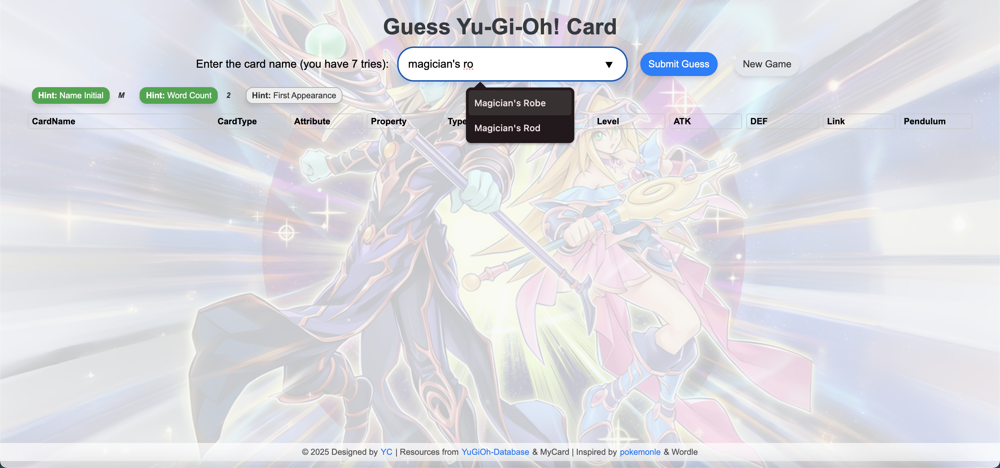
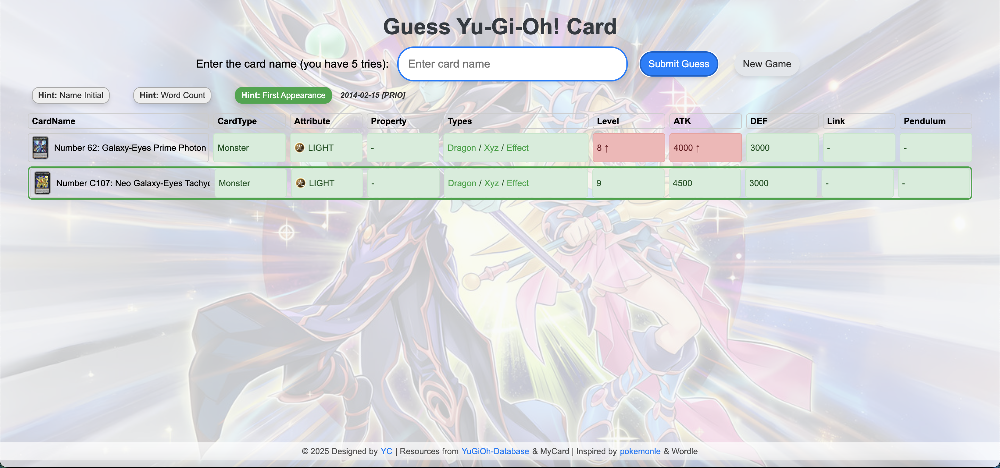
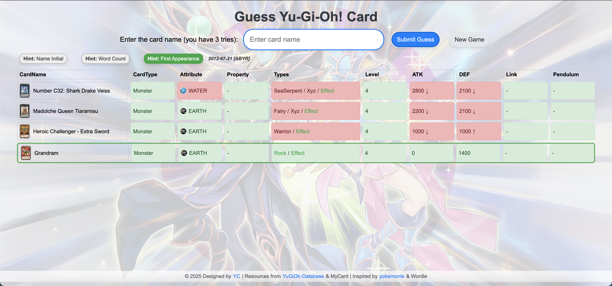

# Yu-Gi-Oh! Card Guessing Game

You can play the game online [here](https://raw.githack.com/yichengxia/yugioh-guess/main/index.html).

A frontend-only web game where players try to guess a randomly selected Yu-Gi-Oh! card from a dataset of real cards. After each guess, the game provides feedback on each attribute, highlighting correct and incorrect fields with visual cues.

Resources from [YuGiOh-Database](https://github.com/Wildric-Auric/YuGiOh-Database).
Inspired by [pokemonle](https://github.com/QuantAskk/pokemonle) and Wordle.

## 猜游戏王卡牌

本项目提供[此处](https://raw.githack.com/yichengxia/yugioh-guess/main/index.html)在线游玩。

纯前端游戏，玩家需要猜测从实卡数据集中随机选择的游戏王卡牌。每次猜测后，游戏会提供关于卡牌每个属性的反馈，给予正确和错误的字段提示。

## Demo

